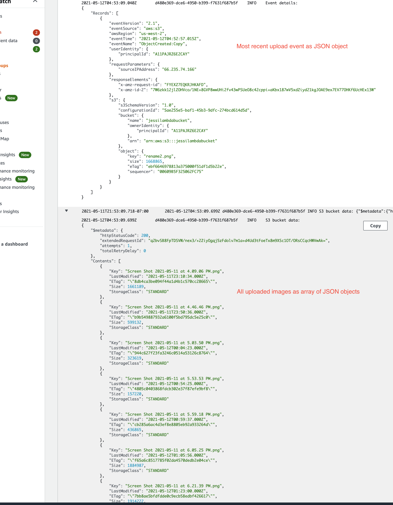

# image-lambda

Author: Jessi Velazquez

# Overview and Description

**An AWS S3 Bucket and lambda process that triggers a lambda function upon uploading an image to a Bucket, and retieving JSON data of the Bucket's contents.**

To use this process, first:

1. Sign in to AWS with Jessi Velazquez's Amazon credentials. 

2. Go to Lambda and open the imageFunction function

3. Import index.js, node_modules, and package.json via one singualr zipped file named index.zip

4. Upload an image (.png) to the "jessilambdabucket" Amazon Web Services S3 bucket.

5. Go back to Lambda and open the imageFunction function

6. Click on "Monitor", and then view logs. You will see the desired output in JSON format.

# Issues

I had many issues in this lab, but many were trivial and/or due to code and import mistakes. The main issue that I believe is worth highlighting was the thing that finally got me logging all bucket objects in a JSON format with metadata. 

This was **adding S3 bucket policy** to the S3 bucket: 

- I realized this was a problem because my logs showed no errors, and the first part of my code (JSON object of upload event (most recent image)) was working. But, the second part of my code that was intended to log an object array of ALL images in the bucket was not. This was giving me some sort of "access denied" error. To achieve this, I was using the S3 method "ListObjectsV2Command". So, I figured that there was something blocking that. I did a bit of Googling and found the Bucket Policy permissions window in the AWS bucket console > Permissions. To use this, you must generate a JSON object of special permission of your choice that basically enebale S3 methods to hit your bucket. I successfully generated the right permissions in JSON format, and this enabled my code to now log a JSON object array of all uploaded images within the bucket. The data persists and adds each new uploaded image. It also contains a metadata section. I updated my code then to stringify this log into JSON as well.

**image.json**

- I am not currently using an images.json file, because this took me all day of wrestling with AWS just to get here, and this is as far as I could get today. However, the JSON data in my logs is exactly what I want in the images.json file, so I am hoping that the hardest part is over, and I just need to figure out how to create the file and push the data I am logging into the file. Since my log out is already in the desired format for the file, I am thinking I will just clean the file out and push the entire log data into the file each time within my lambda function.

# Image of Logs

